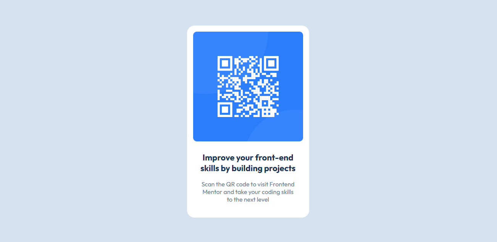

# Frontend Mentor - QR code component solution

This is a solution to the [QR code component challenge on Frontend Mentor](https://www.frontendmentor.io/challenges/qr-code-component-iux_sIO_H). Frontend Mentor challenges help you improve your coding skills by building realistic projects.

## Table of contents

-   [Overview](#overview)
    -   [Screenshot](#screenshot)
    -   [Links](#links)
-   [My process](#my-process)
    -   [Built with](#built-with)
    -   [What I learned](#what-i-learned)
-   [Author](#author)

## Overview

### Screenshot



### Links

-   Solution URL: [Add solution URL here](https://your-solution-url.com)
-   Live Site URL: [Add live site URL here](https://your-live-site-url.com)

## My process

### Built with

-   Semantic HTML5 markup
-   CSS custom properties
-   Flexbox
-   Mobile-first workflow

### What I learned

This was actually the first challenge where I had the figma designs due to it being a free+ tier. It was actually fun to use the designs and get a perfect replica of the design. This also gives me more experience working with figma as a developer.

```html
<article class="qr__code__container">
    <div class="img__container">
        
    </div>
    <div class="content__container">
        <h1>Improve your front-end skills by building projects</h1>
        <p>
            Scan the QR code to visit Frontend Mentor and take your coding
            skills to the next level
        </p>
    </div>
</article>
```

```css
body {
    margin: 0;
    font-family: var(--outfit), sans-serif;
    background-color: var(--slate-300);
    height: 100vh;
    display: flex;
    justify-content: center;
    align-items: center;
    padding: 0 2rem;
}
```

.\*\*

## Author

-   Website - [Dylan Heslop](https://linkedin.com/heslopd23)
-   Frontend Mentor - [@dylan-dot-c](https://www.frontendmentor.io/profile/dylan-dot-c)
